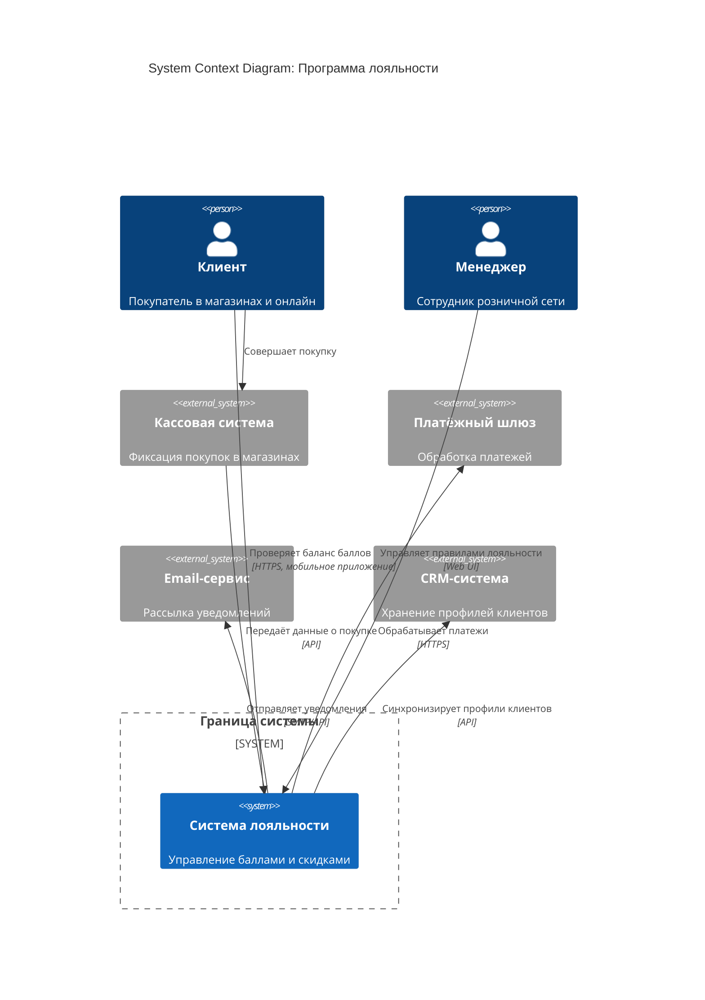

# Диаграммы к Лекции 1

## 1. Схема влияния бизнес-цели на архитектуру

Текстовая схема, показывающая последовательный процесс перевода бизнес-цели в технические решения:

```
┌─────────────┐     ┌──────────────┐     ┌──────────────┐     ┌──────────────────┐     ┌──────────────┐
│ Бизнес-цель │ ──► │ Ограничения  │ ──► │ Требования   │ ──► │ Архитектурные    │ ──► │ Технологии   │
│             │     │              │     │              │     │ решения          │     │              │
└─────────────┘     └──────────────┘     └──────────────┘     └──────────────────┘     └──────────────┘
```

**Пояснение:**
1. **Бизнес-цель** — зачем мы строим систему (например, «увеличить повторные покупки на 20%»)
2. **Ограничения** — что нас ограничивает (бюджет, сроки, команда, регуляторика)
3. **Требования** — что система должна делать и как работать (функциональные и нефункциональные)
4. **Архитектурные решения** — как мы организуем систему (стиль, границы, интеграции)
5. **Технологии** — какие инструменты выберем для реализации (БД, брокеры, фреймворки)

**Важно:** Выбор технологии происходит последним, а не первым.

---

## 2. Пример System Context Diagram в ASCII

Простая текстовая диаграмма для программы лояльности:

```
                    ┌─────────────────────────┐
                    │   Система лояльности    │
                    │                         │
              ┌─────┤   [Баланс баллов]       ├─────┐
              │     │   [Транзакции]          │     │
              │     │   [Правила]             │     │
              │     └─────────────────────────┘     │
              │                                     │
         ┌────▼────┐                          ┌────▼────┐
         │ Клиент  │                          │ Менеджер│
         └─────────┘                          └─────────┘
              │                                     │
         ┌────▼────┐                          ┌────▼────┐
         │  Касса  │                          │  Email  │
         │ система │                          │  сервис │
         └─────────┘                          └─────────┘
              │                                     │
         ┌────▼────┐                          
         │   CRM   │                          
         │ система │                          
         └─────────┘                          
```

**Элементы диаграммы:**
- Центральный блок — наша система («Система лояльности»)
- Человечки/роли — пользователи (Клиент, Менеджер)
- Внешние блоки — системы, с которыми интегрируемся (Касса, Email, CRM)
- Стрелки — направление взаимодействия

---

## 3. Пример System Context Diagram в Mermaid

Формальная диаграмма в нотации C4 Model (Level 1):



---

## 4. Как читать диаграмму System Context

### Условные обозначения C4 Model Level 1

| Элемент | Обозначение | Описание |
|---------|-------------|----------|
| **Person** | Человечек (👤) | Пользователь или роль (клиент, менеджер, администратор) |
| **System** | Прямоугольник | Наша система или внешний сервис |
| **System Boundary** | Пунктирная рамка | Граница проектируемой системы |
| **Relationship** | Стрелка с подписью | Взаимодействие между элементами |

### Правила чтения

1. **Найдите центральный элемент** — это ваша система (в примере — «Система лояльности»).
2. **Определите пользователей** — кто напрямую взаимодействует с системой (Клиент, Менеджер).
3. **Выявите внешние системы** — от каких систем вы зависите (Касса, CRM, Платёжный шлюз, Email).
4. **Прочитайте стрелки** — кто инициирует взаимодействие и какие данные передаются.

### Что показывает эта диаграмма

- **Границы системы:** что внутри нашей ответственности, что — внешние зависимости
- **Потоки данных:** как информация перемещается между системами
- **Точки интеграции:** где нужны API, очереди или другие механизмы связи
- **Зависимости:** без каких внешних систем наша система не сможет работать

### Чего НЕ показывает эта диаграмма

- Внутреннее устройство системы (для этого нужен Container Diagram, Level 2)
- Детали реализации (технологии, протоколы, порты)
- Последовательность действий (для этого нужна Sequence Diagram)

---

## 5. Советы по созданию диаграмм

### Для студентов

1. **Начинайте с границ:** сначала определите, что входит в вашу систему, а что — нет.
2. **Не перегружайте:** 5–8 внешних систем максимум для Level 1.
3. **Подписывайте стрелки:** всегда указывайте, кто инициирует и что передаётся.
4. **Используйте стандартную нотацию:** Person, System, System_Ext, Rel.
5. **Проверяйте полноту:** все ли стейкхолдеры и внешние системы учтены?

### Типичные ошибки

- ❌ Смешивание уровней (показывать БД и пользователя на одной диаграмме контекста)
- ❌ Отсутствие направления стрелок (неясно, кто инициирует запрос)
- ❌ Неподписанные взаимодействия («общается» вместо «передаёт заказ»)
- ❌ Игнорирование внешних зависимостей (забыли нарисовать платёжный шлюз)

---

**Примечание:** Эти диаграммы являются учебными примерами. В реальном проекте количество элементов и связей может быть больше, но принцип остаётся тем же.
