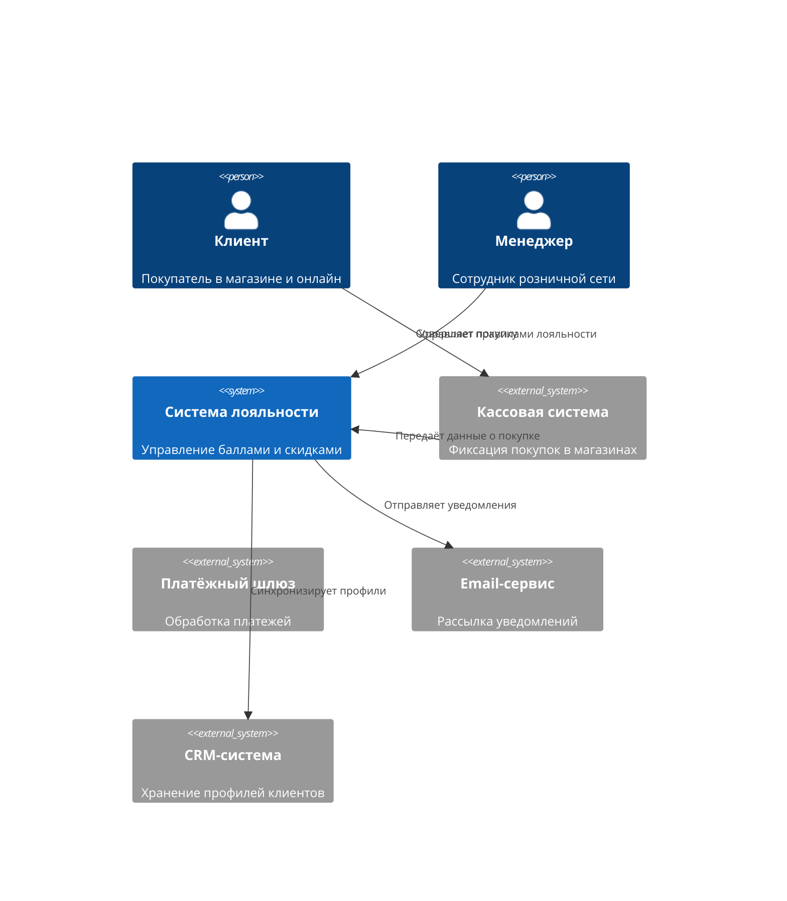
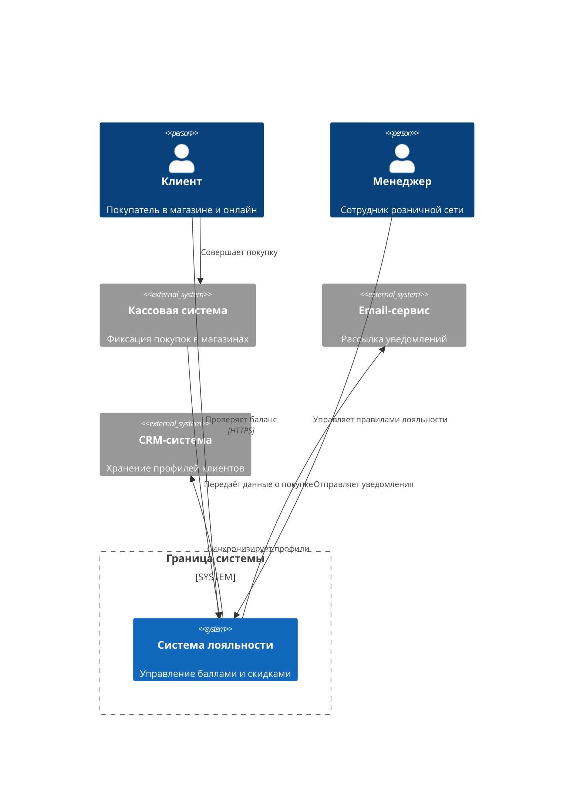

# Лекция 1. Введение в System Design: от бизнес-цели к архитектурным драйверам

## Цель занятия
Научить студентов переводить бизнес-цели в конкретные архитектурные требования и выявлять ключевые драйверы дизайна системы.

## Learning Objectives
По окончании лекции студенты смогут:
1. **Знать** определение System Design и его роль в разработке ИТ-решений.
2. **Понимать** связь между бизнес-целью и архитектурными решениями.
3. **Применять** технику выявления архитектурных драйверов.
4. **Анализировать** ограничения и требования стейкхолдеров.
5. **Создавать** System Context Diagram (C4 Level 1) для проекта.

## План занятия
1. Hook / мотивирующий кейс — 5 мин
2. Теоретический блок — 30 мин
3. Case Study — 20 мин
4. Связка с управленческими решениями — 15 мин
5. Резюме и мостик к следующей лекции — 10 мин

## Hook

Представьте: розничная сеть из 50 магазинов запускает программу лояльности. Бизнес-цель — увеличить повторные покупки на 20% за 6 месяцев. Бюджет — примерно 5 млн руб. на первый год, срок запуска — 3 месяца.

Команда начинает проект с выбора технологии: «Давайте возьмём модную NoSQL базу, она же масштабируемая!». Через месяц после запуска происходит сбой: данные о баллах лояльности теряются частично. Клиенты звонят в поддержку, репутация компании под угрозой.

**Вопрос:** Что пошло не так?

Ответ: команда начала с технологии, а не с понимания бизнес-цели и требований к данным. Для программы лояльности критична сохранность баллов (это деньги клиентов), но архитектура не учитывала это ограничение.

System Design начинается не с выбора базы данных, а с ответа на вопрос: **«Какую бизнес-проблему мы решаем?»**

## Теоретический блок

### Что такое System Design

**System Design (Проектирование системы)** — процесс определения архитектуры, компонентов, модулей, интерфейсов и данных для системы с целью удовлетворения требований.

System Design отвечает на вопросы:
- **Зачем** строится система? (бизнес-цель)
- **Кто** будет использовать систему? (стейкхолдеры)
- **Что** система должна делать? (функциональные требования)
- **Как** система должна работать? (нефункциональные требования)
- **Какие** есть ограничения? (бюджет, сроки, регуляторика)

System Design — это мост между бизнесом и технической реализацией.

### От бизнес-цели к архитектуре

Процесс перевода бизнес-цели в архитектуру выглядит так:

```
Бизнес-цель → Ограничения → Требования → Архитектурные решения → Технологии
```

1. **Бизнес-цель**: Зачем мы это строим? (например, «увеличить повторные покупки на 20%»)
2. **Ограничения**: Что нас ограничивает? (бюджет, сроки, команда, регуляторика)
3. **Требования**: Что система должна делать и как она должна работать?
4. **Архитектурные решения**: Как мы организуем систему для достижения цели?
5. **Технологии**: Какие инструменты выберем для реализации?

**Важно:** Выбор технологии происходит последним, а не первым.

### Архитектурные драйверы

**Архитектурный драйвер** — ключевое требование или ограничение, которое существенно влияет на архитектурные решения.

Драйверы делятся на две категории:

#### Функциональные драйверы
Описывают, **что** система должна делать:
- «Система должна начислять баллы за покупки»
- «Клиент должен иметь возможность тратить баллы онлайн»
- «Система должна интегрироваться с кассовыми терминалами»

#### Нефункциональные драйверы (NFR)
Описывают, **как** система должна работать:
- **Производительность**: «95% запросов должны обрабатываться менее чем за 200 мс»
- **Доступность**: «Система должна быть доступна 99.9% времени в рабочие часы»
- **Надёжность**: «Данные о баллах нельзя потерять ни при каких обстоятельствах»
- **Безопасность**: «Персональные данные должны храниться в зашифрованном виде»
- **Масштабируемость**: «Система должна выдерживать рост нагрузки в 5 раз в период распродаж»

### Роль данных как архитектурного ограничения

Данные — это актив компании. Потеря данных = потеря денег и репутации.

При проектировании архитектуры нужно ответить на вопросы:
1. **Какие данные нельзя потерять?** (например, баланс баллов клиента)
2. **Какие данные требуют строгой согласованности?** (например, транзакции списания)
3. **Какие данные можно кэшировать?** (например, каталог товаров)
4. **Где находится источник истины?** (единое авторитетное хранилище)

**Важно:** Очередь сообщений — это не база данных. Очереди используются для передачи событий, а не для постоянного хранения состояния.

### C4 Model: System Context Diagram

**C4 Model** — упрощённая нотация для визуализации архитектуры на четырёх уровнях. В курсе мы используем первые два уровня.

**System Context Diagram (Level 1)** показывает:
- Систему как единый «чёрный ящик»
- Пользователей (Person)
- Внешние системы (Software System)
- Взаимодействия между ними (Relationship)

Пример System Context Diagram для программы лояльности:



### Стейкхолдеры, ограничения и метрики успеха

#### Стейкхолдеры
**Стейкхолдер** — любое лицо или группа, влияющая на систему или находящаяся под её влиянием.

Для программы лояльности:
- **Клиенты**: хотят простые правила, быстрый доступ к балансу
- **Маркетинг**: хочет рост повторных покупок, гибкость правил
- **ИТ-команда**: хочет стабильность, простоту поддержки
- **Бухгалтерия**: хочет точность начислений, аудируемость
- **Руководство**: хочет ROI, контроль бюджета

#### Ограничения
- **Бюджет**: примерно 5 млн руб. на первый год
- **Сроки**: запуск за 3 месяца
- **Команда**: 3 разработчика, 1 DevOps
- **Регуляторика**: 152-ФЗ о персональных данных

#### Метрики успеха
- Увеличение повторных покупок на 20%
- NPS (индекс лояльности) выше 50
- Доступность системы 99.9%
- Время отклика < 200 мс для 95% запросов

## Case Study

Разберём кейс программы лояльности подробно.

### Шаг 1: Определение бизнес-цели
**Цель:** Увеличить повторные покупки на 20% за 6 месяцев через программу лояльности.

### Шаг 2: Выявление стейкхолдеров
| Стейкхолдер | Интерес | Требование |
|-------------|---------|------------|
| Клиент | Удобство, выгода | Быстрый доступ к балансу, простые правила |
| Маркетинг | Рост продаж | Гибкость настройки правил лояльности |
| ИТ | Стабильность | Простота поддержки, понятная архитектура |
| Бухгалтерия | Точность | Аудируемость начислений, отчётность |
| Руководство | ROI | Контроль бюджета, измеримый результат |

### Шаг 3: Определение ограничений
- **Бюджет:** примерно 5 млн руб. на первый год (лицензии, инфраструктура, разработка)
- **Срок:** запуск за 3 месяца
- **Команда:** 3 backend-разработчика, 1 frontend, 1 DevOps
- **Регуляторика:** хранение персональных данных по 152-ФЗ

### Шаг 4: Выделение ключевых сущностей
1. **Клиент** — физическое лицо, участник программы
2. **Карта лояльности** — идентификатор клиента в программе
3. **Баланс баллов** — количество накопленных баллов
4. **Транзакция** — операция начисления или списания баллов
5. **Правило лояльности** — условия начисления баллов
6. **Покупка** — факт покупки в магазине или онлайн

### Шаг 5: Требования к данным
| Данные | Нельзя потерять? | Согласованность | Хранение |
|--------|------------------|-----------------|----------|
| Баланс баллов | Да | Строгая (strong consistency) | Реляционная БД |
| Транзакции | Да | Строгая, аудит | Реляционная БД |
| Профиль клиента | Да | Строгая | CRM / БД |
| История операций | Да | Eventual consistency допустима | OLAP / архив |
| Каталог товаров | Нет | Eventual consistency | Кэш / поисковый движок |

### Шаг 6: System Context Diagram
Диаграмма показана в теоретическом блоке выше.

### Вывод по кейсу
Архитектура программы лояльности должна:
- Гарантировать сохранность баллов (источник истины — реляционная БД)
- Обеспечивать доступность в часы пик (масштабирование, кэширование)
- Интегрироваться с кассовыми системами (асинхронная передача данных)
- Соответствовать 152-ФЗ (шифрование, доступы, аудит)

## Связка с управленческими решениями

Как ИТ-менеджер или Product Owner, вы принимаете решения, влияющие на архитектуру:

### 1. Скорость запуска vs Масштабируемость
- **Быстрый запуск:** Использовать managed-сервисы (облачные БД, SaaS)
- **Масштабируемость:** Заложить горизонтальное масштабирование с начала

**Trade-off:** Managed-сервисы дороже в долгосроке, но быстрее в запуске.

### 2. Доступность vs Стоимость
- **Доступность 99.9%:** примерно 8 часов простоя в год
- **Доступность 99.99%:** примерно 52 минуты простоя в год

**Trade-off:** Повышение доступности с 99.9% до 99.99% увеличивает стоимость инфраструктуры примерно в 3–5 раз.

### 3. Разработка своей системы vs Покупка готового решения
- **Своя разработка:** Гибкость, контроль, но долго и дорого
- **Готовое решение (SaaS):** Быстро, но меньше гибкости, vendor lock-in

**Trade-off:** Для стартапа SaaS может быть оптимальным, для энтерпрайза — своя разработка.

### 4. Почему архитектура важнее технологии
Технология — это инструмент. Архитектура — это план использования инструментов.

**Пример:** Можно построить надёжный дом из кирпича или из дерева. Но если фундамент кривой, дом рухнет независимо от материала.

Так и в ИТ: неправильная архитектура приведёт к проблемам даже с лучшими технологиями.

## Ключевые термины

| Термин | Определение |
|--------|-------------|
| **System Design** | Процесс проектирования архитектуры системы для удовлетворения требований |
| **Архитектурный драйвер** | Ключевое требование или ограничение, влияющее на архитектурные решения |
| **Стейкхолдер** | Лицо или группа, влияющая на систему или находящаяся под её влиянием |
| **System Context Diagram** | Диаграмма C4 Level 1, показывающая систему и внешние взаимодействия |
| **NFR (Non-Functional Requirement)** | Нефункциональное требование, описывающее как система должна работать |
| **Source of Truth** | Единственное авторитетное хранилище данных |
| **Strong Consistency** | Гарантия, что после записи все пользователи видят актуальные данные |
| **Eventual Consistency** | Гарантия, что данные станут согласованными через некоторое время |
| **ADR (Architecture Decision Record)** | Документ, фиксирующий принятое архитектурное решение |

## Визуальные материалы

### Схема влияния бизнес-цели на архитектуру

```
┌─────────────┐     ┌──────────────┐     ┌──────────────┐     ┌──────────────────┐     ┌──────────────┐
│ Бизнес-цель │ ──► │ Ограничения  │ ──► │ Требования   │ ──► │ Архитектурные    │ ──► │ Технологии   │
│             │     │              │     │              │     │ решения          │     │              │
└─────────────┘     └──────────────┘     └──────────────┘     └──────────────────┘     └──────────────┘
```

### Пример System Context Diagram (ASCII)

```
                    ┌─────────────────────────┐
                    │   Система лояльности    │
                    │                         │
              ┌─────┤   [Баланс баллов]       ├─────┐
              │     │   [Транзакции]          │     │
              │     │   [Правила]             │     │
              │     └─────────────────────────┘     │
              │                                     │
         ┌────▼────┐                          ┌────▼────┐
         │ Клиент  │                          │ Менеджер│
         └─────────┘                          └─────────┘
              │                                     │
         ┌────▼────┐                          ┌────▼────┐
         │  Касса  │                          │  Email  │
         │ система │                          │  сервис │
         └─────────┘                          └─────────┘
```

### Пример System Context Diagram (Mermaid)



### Как читать диаграмму
1. **Person** (человечек) — пользователь или роль
2. **System** (прямоугольник) — наша система или внешний сервис
3. **Rel** (стрелка) — взаимодействие с подписью
4. **Boundary** (пунктирная рамка) — граница нашей системы

## Anti-pattern

### ❌ Выбор технологии до понимания задачи
**Ошибка:** «Давайте возьмём Kubernetes и Kafka, потому что это модно!»

**Последствия:** Избыточная сложность, высокие затраты на инфраструктуру и команду, долгое время выхода на рынок.

**Правильно:** Сначала понять бизнес-цель, ограничения и требования, затем выбрать подходящие технологии.

### ❌ Использование очереди как базы данных
**Ошибка:** Хранение состояния (баланс баллов) в очереди сообщений.

**Последствия:** Потеря данных при сбоях, невозможность выполнить сложные запросы, отсутствие транзакционности.

**Правильно:** Очередь — для передачи событий, БД — для хранения состояния.

### ❌ Игнорирование ограничений
**Ошибка:** Проектирование системы без учёта бюджета, сроков или регуляторики.

**Последствия:** Проект не будет завершён в срок или превысит бюджет, возможны штрафы за нарушение регуляторики.

**Правильно:** Явно зафиксировать ограничения в Architecture Brief.

### ❌ Попытка максимизировать все NFR
**Ошибка:** «Хотим максимальную производительность, доступность, безопасность и низкую стоимость одновременно!»

**Последствия:** Невозможно достичь всех максимумов одновременно, бюджет будет превышен.

**Правильно:** Приоритезировать NFR, выбирать ключевые драйверы, осознавать trade-offs.

## Практическое задание

### Цель
Создать Architecture Brief и System Context Diagram для программы лояльности.

### Задание

1. **Опишите бизнес-цель** (1 абзац):
   - Какую проблему решает система?
   - Какой измеримый результат ожидается?

2. **Определите стейкхолдеров** (3–5 ролей):
   - Кто заинтересован в системе?
   - Какие у них требования?

3. **Выявите ограничения**:
   - Бюджет (примерно)
   - Сроки
   - Команда
   - Регуляторика

4. **Выделите ключевые сущности** (5–7 элементов):
   - Какие данные будет хранить система?
   - Какие операции будут выполняться?

5. **Определите требования к данным**:
   - Какие данные нельзя потерять?
   - Какие данные требуют строгой согласованности?
   - Какие данные можно кэшировать?

6. **Нарисуйте System Context Diagram**:
   - Используйте Mermaid или ASCII
   - Покажите пользователей, систему, внешние сервисы
   - Подпишите взаимодействия

### Шаблон результата

```markdown
# Architecture Brief: Программа лояльности

## Бизнес-цель
...

## Стейкхолдеры
| Роль | Требование |
|------|------------|
| ...  | ...        |

## Ограничения
- Бюджет: ...
- Сроки: ...
- Команда: ...
- Регуляторика: ...

## Ключевые сущности
1. ...
2. ...
3. ...

## Требования к данным
| Данные | Нельзя потерять? | Согласованность |
|--------|------------------|-----------------|
| ...    | ...              | ...             |

## System Context Diagram
[диаграмма]
```

### Критерии оценки
| Критерий | Вес | Описание |
|----------|-----|----------|
| Полнота анализа стейкхолдеров | 20% | Все ключевые роли учтены |
| Корректность границ системы | 20% | Чёткое разделение своей и внешних систем |
| Учёт ограничений | 20% | Ограничения отражены в архитектуре |
| Требования к данным | 20% | Верно определены critical data |
| Качество диаграммы | 20% | Читается, соблюдена нотация C4 |

## Мостик к следующей лекции

Сегодня мы научились переводить бизнес-цель в архитектурные требования и рисовать System Context Diagram. Но как декомпозировать сложную систему на управляемые части?

**Лекция 2 ответит на вопросы:**
- Что такое Domain-Driven Design (DDD)?
- Как выделить границы контекстов (Bounded Contexts)?
- Что такое Event Storming и как его проводить?
- Как формализовать требования к качеству через Quality Attribute Scenarios?

Мы перейдём от высокоуровневого контекста к детальному моделированию предметной области.

## Вопросы для самопроверки

1. Что такое System Design и зачем он нужен бизнесу?
2. Назовите 5 типов архитектурных драйверов.
3. В чём разница между функциональными и нефункциональными требованиями?
4. Почему очередь сообщений нельзя использовать как базу данных?
5. Что показывает System Context Diagram (C4 Level 1)?
6. Кто такие стейкхолдеры и почему их важно учитывать?
7. Что такое Source of Truth?
8. Почему выбор технологии происходит после определения архитектуры?
