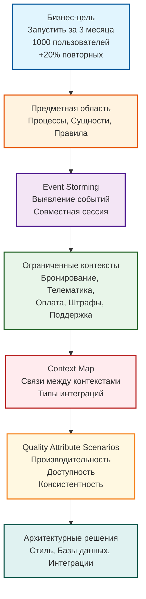
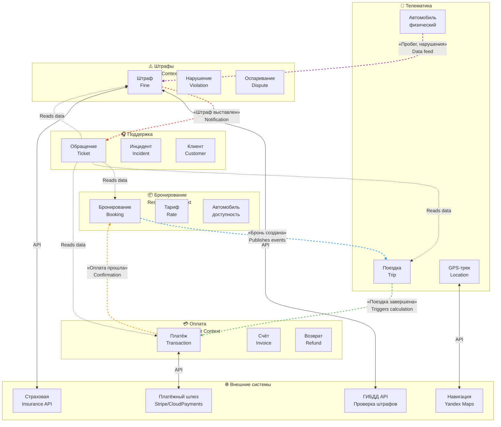

# Диаграммы к Лекции 2

## Введение

Этот файл содержит диаграммы и схемы, используемые в Лекции 2 «Предметная область и требования: DDD, Event Storming, Quality Attribute Scenarios».

Диаграммы предназначены для:
- Визуализации процесса от бизнес-цели к архитектуре через DDD
- Показа примера Event Storming доски
- Иллюстрации Context Map для кейса каршеринга
- Объяснения шаблона Quality Attribute Scenario

---

## Диаграмма 1. Процесс от бизнес-цели к архитектуре через DDD

**Описание:** Схема показывает последовательность шагов от формулировки бизнес-цели до принятия архитектурных решений с использованием методов DDD.

### ASCII-версия

```
┌─────────────────────────────────────────────────────────────────────────────┐
│                         ОТ БИЗНЕС-ЦЕЛИ К АРХИТЕКТУРЕ                        │
│                              (через DDD)                                    │
└─────────────────────────────────────────────────────────────────────────────┘

    ┌──────────────────┐
    │   Бизнес-цель    │
    │                  │
    │ • Запустить за   │
    │   3 месяца       │
    │ • 1000 пользователей│
    │ • +20% повторных │
    └────────┬─────────┘
             │
             ▼
    ┌──────────────────┐
    │ Предметная       │
    │ область (Domain) │
    │                  │
    │ • Процессы       │
    │ • Сущности       │
    │ • Правила        │
    └────────┬─────────┘
             │
             ▼
    ┌──────────────────┐
    │ Event Storming   │
    │                  │
    │ • Выявление      │
    │   событий        │
    │ • Совместная     │
    │   сессия         │
    └────────┬─────────┘
             │
             ▼
    ┌──────────────────┐
    │ Ограниченные     │
    │ контексты        │
    │ (Bounded Contexts)│
    │                  │
    │ • Бронирование   │
    │ • Телематика     │
    │ • Оплата         │
    │ • Штрафы         │
    │ • Поддержка      │
    └────────┬─────────┘
             │
             ▼
    ┌──────────────────┐
    │ Context Map      │
    │                  │
    │ • Связи между    │
    │   контекстами    │
    │ • Типы интеграций│
    └────────┬─────────┘
             │
             ▼
    ┌──────────────────┐
    │ Quality Attribute│
    │ Scenarios        │
    │                  │
    │ • Производитель- │
    │   ность          │
    │ • Доступность    │
    │ • Консистент-    │
    │   ность          │
    └────────┬─────────┘
             │
             ▼
    ┌──────────────────┐
    │ Архитектурные    │
    │ решения          │
    │                  │
    │ • Стиль (монолит,│
    │   микросервисы)  │
    │ • Базы данных    │
    │ • Интеграции     │
    └──────────────────┘
```

### Mermaid-версия



**Как читать:**
1. Движение сверху вниз показывает последовательность шагов
2. Каждый блок — это артефакт, создаваемый на соответствующем этапе
3. Цвета блоков обозначают тип артефакта:
   - Синий: бизнес-входные данные
   - Оранжевый: анализ домена
   - Фиолетовый: совместная работа
   - Зелёный: структурные элементы
   - Красный: связи и интеграции
   - Жёлтый: требования к качеству
   - Бирюзовый: итоговые решения

---

## Диаграмма 2. Пример Event Storming доски (ASCII)

**Описание:** Упрощённый пример доски Event Storming для процесса бронирования автомобиля в сервисе каршеринга.

```
┌─────────────────────────────────────────────────────────────────────────────┐
│                    EVENT STORMING: КАШАРИНГ (БРОНИРОВАНИЕ)                  │
├─────────────────────────────────────────────────────────────────────────────┤
│                                                                             │
│  👤 Пользователь                                                            │
│         │                                                                   │
│         ▼                                                                   │
│  ┌─────────────────┐                                                        │
│  │ Забронировать   │ ← 🔵 Command (синий стикер)                           │
│  │ автомобиль      │                                                        │
│  └────────┬────────┘                                                        │
│           │                                                                 │
│           ▼                                                                 │
│  ┌─────────────────┐                                                        │
│  │ Автомобиль      │ ← 🟠 Domain Event (оранжевый стикер)                  │
│  │ забронирован    │                                                        │
│  └────────┬────────┘                                                        │
│           │                                                                 │
│           ▼                                                                 │
│  ┌─────────────────┐                                                        │
│  │ Подтвердить     │ ← 🔵 Command                                          │
│  │ бронирование    │                                                        │
│  └────────┬────────┘                                                        │
│           │                                                                 │
│           ▼                                                                 │
│  ┌─────────────────┐                                                        │
│  │ Бронирование    │ ← 🟠 Domain Event                                     │
│  │ подтверждено    │                                                        │
│  └────────┬────────┘                                                        │
│           │                                                                 │
│           ▼                                                                 │
│  ┌─────────────────┐      ┌─────────────────┐                              │
│  │   Бронирование  │      │    Телематика   │                              │
│  │   (агрегат)     │      │   (контекст)    │                              │
│  │   🟡 Aggregate  │      │   ⬛ Context     │                              │
│  └─────────────────┘      └─────────────────┘                              │
│                                                                             │
│  ┌─────────────────────────────────────────────────────────────────┐        │
│  │  🟢 Policy: Если бронирование отменено < 24ч → удержать штраф   │        │
│  └─────────────────────────────────────────────────────────────────┘        │
│                                                                             │
│  ┌─────────────────────────────────────────────────────────────────┐        │
│  │  🔴 PROBLEM: Неясно, кто отвечает за возврат залога при отмене  │        │
│  └─────────────────────────────────────────────────────────────────┘        │
│                                                                             │
│  ┌─────────────────┐      ┌─────────────────┐                              │
│  │  🟣 Stripe      │      │  🟣 ГИБДД API    │ ← 🟣 External System         │
│  │  (платёжный     │      │  (проверка       │   (фиолетовый стикер)       │
│  │   шлюз)         │      │   штрафов)       │                              │
│  └─────────────────┘      └─────────────────┘                              │
│                                                                             │
└─────────────────────────────────────────────────────────────────────────────┘

Условные обозначения:
👤 Actor (роль)
🔵 Command (команда)
🟠 Domain Event (событие предметной области)
🟡 Aggregate (агрегат)
🟢 Policy (политика/правило)
🔴 Problem (проблема/вопрос)
🟣 External System (внешняя система)
⬛ Bounded Context (ограниченный контекст)
```

**Как читать:**
1. Поток идёт слева направо и сверху вниз (временная последовательность)
2. Команды (синие) инициируют события (оранжевые)
3. Агрегаты (жёлтые) обрабатывают команды и генерируют события
4. Политики (зелёные) реагируют на события и запускают новые команды
5. Проблемы (красные) отмечают противоречия для дальнейшего обсуждения
6. Внешние системы (фиолетовые) показывают интеграции
7. Контексты (чёрные рамки) группируют связанные агрегаты

---

## Диаграмма 3. Context Map для сервиса каршеринга (Mermaid)

**Описание:** Карта контекстов показывает выделенные ограниченные контексты и связи между ними для кейса каршеринга.



**Как читать:**
1. **Блоки (subgraph):** Каждый прямоугольник с заголовком — это ограниченный контекст
2. **Внутренние элементы:** Сущности внутри контекста (например, «Бронирование», «Тариф»)
3. **Стрелки:** Направление потока данных или событий
4. **Подписи на стрелках:** Тип передаваемой информации или события
5. **Внешние системы:** Отдельный блок для интеграций с внешними сервисами

**Типы связей (по цветам):**
- 🔵 **Синий:** Публикация событий (Event-driven)
- 🟢 **Зелёный:** Триггер процесса (Process trigger)
- 🟠 **Оранжевый:** Подтверждение (Confirmation)
- 🟣 **Фиолетовый:** Передача данных (Data feed)
- 🔴 **Красный:** Уведомление (Notification)

**Типы отношений DDD:**
- **Partnership:** Бронирование ↔ Телематика (совместное развитие)
- **Customer-Supplier:** Телематика → Оплата (Телематика поставляет данные)
- **ACL (Anti-Corruption Layer):** Оплата → Платёжный шлюз (защита от внешней модели)
- **Conformist:** Поддержка → Все контексты (читает данные в их моделях)

---

## Диаграмма 4. Шаблон Quality Attribute Scenario

**Описание:** Визуальное представление шаблона для формулировки нефункциональных требований.

### Табличная версия

| Элемент | Описание | Вопрос | Пример для каршеринга |
|---------|----------|--------|----------------------|
| **Source of Stimulus** | Источник воздействия | Кто или что инициирует требование? | Пользователь мобильного приложения |
| **Stimulus** | Воздействие | Что происходит? | Отправляет запрос на бронирование |
| **Environment** | Окружение | В каких условиях? | Часы пик (18:00–20:00), 500 одновременных пользователей |
| **Artifact** | Артефакт | Какой компонент системы? | Сервис бронирования (Booking Service) |
| **Response** | Реакция | Что должна сделать система? | Обработать запрос и подтвердить бронирование |
| **Response Measure** | Мера реакции | Как измерить выполнение? | 95% запросов < 300 мс |

### Визуальная схема

```
┌─────────────────────────────────────────────────────────────────────────────┐
│                    QUALITY ATTRIBUTE SCENARIO                               │
├─────────────────────────────────────────────────────────────────────────────┤
│                                                                             │
│  ┌─────────────┐     ┌─────────────┐                                        │
│  │   Source    │────▶│   Stimulus  │                                        │
│  │   of        │     │             │                                        │
│  │   Stimulus  │     │             │                                        │
│  │             │     │             │                                        │
│  │ Пользователь│     │ Запрос на   │                                        │
│  │             │     │ бронирование│                                        │
│  └─────────────┘     └──────┬──────┘                                        │
│                             │                                               │
│                             ▼                                               │
│  ┌─────────────────────────────────────────────────────────────────┐        │
│  │                      Environment                                │        │
│  │                                                                 │        │
│  │  Часы пик (18:00–20:00), 500 одновременных пользователей        │        │
│  └─────────────────────────────────────────────────────────────────┘        │
│                             │                                               │
│                             ▼                                               │
│  ┌─────────────────────────────────────────────────────────────────┐        │
│  │                       Artifact                                  │        │
│  │                                                                 │        │
│  │              Сервис бронирования (Booking Service)              │        │
│  └─────────────────────────────────────────────────────────────────┘        │
│                             │                                               │
│                             ▼                                               │
│  ┌─────────────┐     ┌─────────────┐                                        │
│  │   Response  │◀────│   Response  │                                        │
│  │             │     │   Measure   │                                        │
│  │ Обработать  │     │             │                                        │
│  │ и подтвердить│    │  95% < 300мс│                                        │
│  └─────────────┘     └─────────────┘                                        │
│                                                                             │
└─────────────────────────────────────────────────────────────────────────────┘

Итоговая формулировка:
"При нагрузке 500 одновременных пользователей в часы пик (18:00–20:00) 
сервис бронирования должен обрабатывать 95% запросов менее чем за 300 мс."
```

---

## Диаграмма 5. Сравнение понимания сущности «Автомобиль» в разных контекстах

**Описание:** Показывает, как одна и та же бизнес-сущность может иметь разные представления в разных ограниченных контекстах.

```
┌─────────────────────────────────────────────────────────────────────────────┐
│              ЕДИНАЯ СУЩНОСТЬ «АВТОМОБИЛЬ» В РАЗНЫХ КОНТЕКСТАХ               │
└─────────────────────────────────────────────────────────────────────────────┘

┌─────────────────┐  ┌─────────────────┐  ┌─────────────────┐  ┌─────────────────┐
│   📦            │  │   📍            │  │   💳            │  │   🎧            │
│   БРОНИРОВАНИЕ  │  │   ТЕЛЕМАТИКА    │  │   БУХГАЛТЕРИЯ   │  │   ПОДДЕРЖКА     │
│                 │  │                 │  │                 │  │                 │
│  «Доступный     │  │  «Физический    │  │  «Актив         │  │  «Объект        │
│   ресурс»       │  │   объект»       │  │   компании»     │  │   обращений»    │
└────────┬────────┘  └────────┬────────┘  └────────┬────────┘  └────────┬────────┘
         │                    │                    │                    │
         ▼                    ▼                    ▼                    ▼
┌─────────────────────────────────────────────────────────────────────────────────┐
│                            КЛЮЧЕВЫЕ АТРИБУТЫ                                    │
├─────────────────┬─────────────────┬─────────────────┬───────────────────────────┤
│ • ID            │ • VIN           │ • Балансовая    │ • История инцидентов      │
│ • Класс         │ • Координаты GPS│   стоимость     │ • Отзывы клиентов         │
│ • Тариф         │ • Уровень топлива│ • Амортизация  │ • Ремонты                 │
│ • Статус        │ • Пробег        │ • Налоговая     │ • Текущие проблемы        │
│   доступности   │ • Статус        │   категория     │                           │
│ • Доступно с/по │ • Датчики       │ • Дата покупки  │                           │
└─────────────────┴─────────────────┴─────────────────┴───────────────────────────┘

❌ АНТИ-ПАТТЕРН: Попытка создать единую таблицу со всеми атрибутами
   → Таблица растёт бесконтрольно
   → Любое изменение затрагивает все модули
   → Невозможно оптимизировать под конкретные нужды

✅ ПАТТЕРН: Separate Models per Context
   → telematics.vehicles (для телематики)
   → reservation.available_cars (для бронирования)
   → accounting.assets (для бухгалтерии)
   → support.incidents (для поддержки)
```

---

## Рекомендации по использованию диаграмм

### Для преподавателя

1. **Диаграмма 1 (Процесс DDD):** Используйте в начале лекции для показа общего потока от бизнес-цели к архитектуре.

2. **Диаграмма 2 (Event Storming):** Покажите во время объяснения метода Event Storming. Можно использовать как шаблон для практической сессии.

3. **Диаграмма 3 (Context Map):** Используйте в разделе Case Study для демонстрации выделенных контекстов каршеринга.

4. **Диаграмма 4 (Quality Attribute Scenario):** Покажите при объяснении нефункциональных требований. Используйте как шаблон для практики.

5. **Диаграмма 5 (Сравнение моделей):** Используйте для иллюстрации важности Bounded Context и опасности единой модели на всю систему.

### Для студентов

1. Сохраните диаграммы как справочный материал
2. Используйте шаблоны для выполнения практического задания
3. При создании собственных диаграмм следуйте тем же соглашениям (цвета, обозначения)
4. Мерmaid-диаграммы можно рендерить в GitHub, GitLab, Notion, Obsidian

### Технические примечания

- **Mermaid-диаграммы** совместимы с GitHub, GitLab, Notion, Obsidian, большинством LMS
- **ASCII-диаграммы** работают в любом текстовом редакторе
- Для печати рекомендуется экспортировать Mermaid в PNG/SVG через [mermaid.live](https://mermaid.live)
- Размеры шрифтов и отступы могут требовать настройки для проектора
