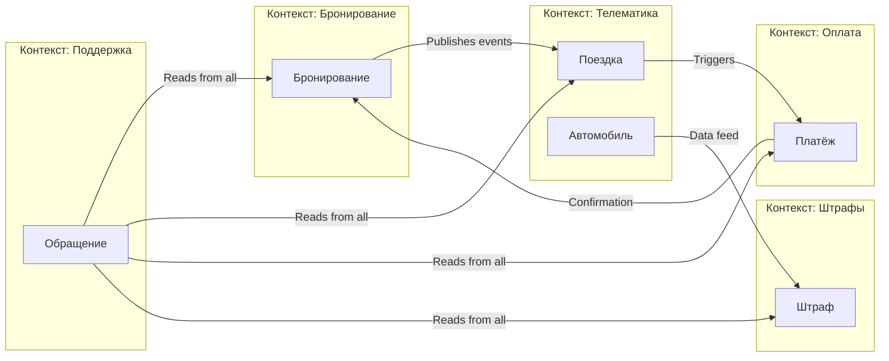
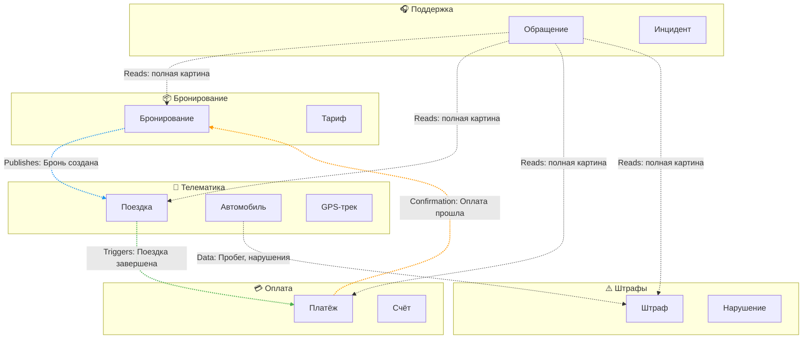

# Лекция 2. Предметная область и требования: DDD, Event Storming, Quality Attribute Scenarios

## Цель занятия

Научить студентов декомпозировать сложную предметную область с помощью методов Domain-Driven Design (DDD), выявлять ключевые бизнес-события через Event Storming и формализовать требования к качеству системы через Quality Attribute Scenarios.

## Learning Objectives

По окончании лекции студенты смогут:

1. Объяснить, почему понимание предметной области критично для архитектуры ИТ-системы
2. Применять ключевые понятия DDD: Ubiquitous Language, Bounded Context, Context Map, Aggregate, Entity, Value Object
3. Провести мини-сессию Event Storming для выявления доменных событий и процессов
4. Различать функциональные и нефункциональные требования
5. Сформулировать Quality Attribute Scenario по шаблону (stimulus, environment, response, response measure)
6. Показать, как границы контекстов влияют на архитектуру данных и интеграционные решения

## План занятия

1. Hook / мотивирующий кейс — 5 мин
2. Теоретический блок — 30 мин
3. Case Study — 20 мин
4. Связка с управленческими решениями — 15 мин
5. Резюме и мостик к следующей лекции — 10 мин

## Hook

**Ситуация:** Компания запускает сервис каршеринга в крупном городе. В парке — примерно 200 автомобилей, целевая аудитория — городские жители, планируем запуск через 3 месяца.

**Проблема:** Через месяц разработки выясняется, что разные отделы по-разному понимают ключевые сущности:

- **Отдел эксплуатации** считает «Автомобиль» как физический объект с VIN, пробегом, уровнем топлива, местоположением GPS. Для них важны технические параметры и состояние.

- **Бухгалтерия** видит «Автомобиль» как актив с балансовой стоимостью, амортизацией, налоговыми категориями. Их волнует учёт и списание стоимости.

- **Отдел продаж** понимает «Автомобиль» как товар с тарифом, скидками, акциями, доступностью для бронирования. Их интересует доходность.

- **Разработчики** создали единую таблицу `cars` с 47 полями, куда пытаются уместить все представления сразу.

**Результат:** 
- Ошибки интеграции между модулями
- Дублирование данных (одни и те же данные хранятся в разных форматах)
- Невозможность изменить модель без поломки других частей системы
- Задержка запуска на 2 месяца из-за переделки архитектуры

**Вопрос аудитории:** Как избежать недопонимания между отделами и создать архитектуру, которая отражает реальную структуру бизнеса?

**Ответ,** который мы найдём сегодня: Domain-Driven Design (DDD) предоставляет инструменты для работы со сложными предметными областями через единый язык и чёткие границы контекстов.

## Теоретический блок

### Часть 1. Domain-Driven Design (DDD)

#### Что такое DDD?

**Domain-Driven Design (DDD)** — это подход к разработке программного обеспечения, который фокусируется на глубоком понимании предметной области (domain) и отражении её структуры в коде и архитектуре системы.

DDD был предложен Эриком Эвансом в 2003 году в книге «Domain-Driven Design: Tackling Complexity in the Heart of Software». Подход особенно полезен для сложных систем с богатой бизнес-логикой.

**Ключевая идея DDD:** Архитектура системы должна отражать структуру предметной области, а не технические слои (UI, Backend, Database).

#### Ubiquitous Language (Единый язык)

**Ubiquitous Language** — это общий словарь терминов, используемый разработчиками и экспертами предметной области.

**Зачем нужен:**
- Устраняет недопонимание между бизнесом и технической командой
- Каждый термин имеет одно точное значение
- Снижает количество встреч и уточнений
- Позволяет автоматически генерировать документацию из кода

**Правило использования:** Если термин меняется в коде, он должен измениться в документации и речи экспертов, и наоборот.

**Пример для каршеринга:**
- «Бронирование» (Reservation) — всегда означает оформленную заявку клиента на конкретный автомобиль с указанием времени начала и окончания
- «Поездка» (Trip) — факт использования автомобиля от момента открытия дверей до закрытия и оплаты
- «Автомобиль» (Vehicle) — в разных контекстах может означать разное, но внутри одного контекста термин стабилен

**Анти-паттерн:** Использование одного термина для разных понятий («Заказ» может означать и бронирование, и поездку, и счёт на оплату).

#### Bounded Context (Ограниченный контекст)

**Bounded Context** — это граница, внутри которой работает определённая модель предметной области со своим единым языком.

**Зачем нужны:**
- Позволяют разным частям системы использовать одни и те же термины по-разному без конфликтов
- Управляют сложностью через разделение ответственности
- Становятся естественными границами для микросервисов

**Пример для каршеринга:**

| Контекст | Понятие «Автомобиль» | Ключевые атрибуты |
|----------|---------------------|-------------------|
| Бронирование | Доступный для заказа ресурс | ID, класс, тариф, статус доступности |
| Телематика | Физический объект с датчиками | VIN, координаты GPS, уровень топлива, пробег |
| Бухгалтерия | Актив компании | Балансовая стоимость, амортизация, налоговая категория |
| Поддержка | Объект обращений клиентов | История инцидентов, ремонты, отзывы |

**Важное правило:** Одна модель — один контекст. Не пытайтесь создать универсальную модель на всю систему.

#### Context Map (Карта контекстов)

**Context Map** — это диаграмма, показывающая взаимосвязи между ограниченными контекстами.

**Типы связей между контекстами:**

| Тип связи | Описание | Пример |
|-----------|----------|--------|
| Partnership | Контексты сотрудничают на равных | Бронирование и Оплата совместно развивают общий процесс |
| Shared Kernel | Общая часть модели между контекстами | Общий справочник тарифов |
| Customer-Supplier | Один контекст зависит от другого | Поддержка зависит от данных Телематики |
| Conformist | Зависимый контекст вынужден следовать модели поставщика | Отчётность следует модели Бухгалтерии |
| Anti-Corruption Layer (ACL) | Слой защиты от чужой модели | Адаптер для интеграции с внешней платёжной системой |
| Open Host Service | Публикация API для всех | Публичный API для партнёров |
| Published Language | Общий формат обмена | JSON Schema для событий |

**Зачем нужна Context Map:**
- Визуализирует зависимости между командами
- Помогает планировать интеграцию
- Выявляет скрытые связанные части системы

#### Aggregate, Entity, Value Object (кратко)

**Entity (Сущность)** — объект, который имеет уникальный идентификатор и изменяемое состояние.

*Пример:* Автомобиль (идентифицируется по VIN), Клиент (по ID в системе).

**Value Object (Объект-значение)** — объект, который определяется своими атрибутами, а не идентификатором. Неизменяем.

*Пример:* Адрес (определяется улицей, домом, квартирой), Деньги (сумма и валюта).

**Aggregate (Агрегат)** — группа связанных объектов, которые рассматриваются как единое целое. У агрегата есть корень (Aggregate Root) — единственная точка входа для изменений.

*Пример:* Агрегат «Бронирование» включает сущность Бронирование (корень), Value Object Период, Value Object Стоимость. Изменять можно только через корень.

**Правило:** Транзакции должны проходить в границах одного агрегата. Это упрощает обеспечение консистентности.

### Часть 2. Event Storming

#### Что такое Event Storming?

**Event Storming** — это метод совместного анализа предметной области, разработанный Альберто Брандолини. Это фасилитированная сессия, где участники (бизнес-эксперты, разработчики, аналитики) вместе выявляют бизнес-события и процессы с помощью цветных стикеров на большой доске.

**Цель Event Storming:** Быстро (за 2–4 часа) получить общее понимание предметной области, выявить противоречия и пробелы в знаниях.

#### Роли участников

| Роль | Кто участвует | Вклад |
|------|---------------|-------|
| Бизнес-эксперты | Product Owner, менеджеры, операторы | Знание процессов и правил |
| Разработчики | Backend, Frontend, Architects | Техническая реализуемость |
| Аналитики | Business Analysts | Фасилитация, документирование |
| Тестировщики | QA Engineers | Проверка полноты сценариев |

#### Типы стикеров

| Цвет | Тип | Описание | Пример |
|------|-----|----------|--------|
| 🟠 Оранжевый | Domain Event | Факт, произошедший в системе | «Автомобиль забронирован» |
| 🔵 Синий | Command | Действие, которое инициирует событие | «Забронировать автомобиль» |
| 🟡 Жёлтый | Aggregate | Группа объектов, обрабатывающая команду | Агрегат «Бронирование» |
| 🟢 Зелёный | Policy | Правило, реагирующее на событие | «Если бронирование отменено < 24ч, удержать штраф» |
| 🟣 Фиолетовый | External System | Внешняя система | Платёжный шлюз, SMS-провайдер |
| 🔴 Красный | Problem | Проблема, вопрос, противоречие | «Неясно, кто отвечает за возврат залога» |
| ⬜ Белый | Read Model | Данные для отображения | Список доступных автомобилей |
| ⬛ Чёрный | Bounded Context | Граница контекста | Контекст «Бронирование» |

#### Процесс проведения сессии

**Этап 1: Выявление событий (15–30 мин)**
- Участники пишут доменные события на оранжевых стикерах
- События формулируются в прошедшем времени: «Что произошло?»
- Располагаются слева направо в хронологическом порядке

**Этап 2: Добавление команд (15 мин)**
- Для каждого события определяем команду, которая его инициировала
- Команды формулируются в повелительном наклонении: «Сделай что-то»

**Этап 3: Выявление агрегатов (15 мин)**
- Определяем, какие объекты обрабатывают команды
- Группируем связанные объекты в агрегаты

**Этап 4: Определение политик (15 мин)**
- Выявляем правила, которые реагируют на события
- Формулируем политики: «Если событие X, то сделать Y»

**Этап 5: Выделение контекстов (15 мин)**
- Группируем агрегаты в ограниченные контексты
- Обозначаем границы чёрными стикерами

**Этап 6: Выявление проблем (10 мин)**
- Отмечаем красными стикерами противоречия и вопросы
- Планируем дальнейшее исследование

### Часть 3. Quality Attribute Scenarios

#### Функциональные vs Нефункциональные требования

**Функциональные требования** описывают, **что** система должна делать:
- «Система должна позволять пользователю забронировать автомобиль»
- «Система должна рассчитывать стоимость поездки»
- «Система должна отправлять уведомления об окончании бронирования»

**Нефункциональные требования (NFR)** описывают, **как** система должна работать:
- «95% запросов на бронирование должны обрабатываться менее чем за 300 мс»
- «Система должна быть доступна 99.9% времени в часы пик»
- «Данные о местоположении автомобилей должны обновляться каждые 10 секунд»

#### Шаблон Quality Attribute Scenario

Quality Attribute Scenario — это структурированный способ формулировки нефункциональных требований.

**Шаблон включает 6 элементов:**

| Элемент | Описание | Вопрос |
|---------|----------|--------|
| Source of Stimulus | Источник воздействия | Кто или что инициирует требование? |
| Stimulus | Воздействие | Что происходит? |
| Environment | Окружение | В каких условиях? |
| Artifact | Артефакт | Какой компонент системы? |
| Response | Реакция | Что должна сделать система? |
| Response Measure | Мера реакции | Как измерить выполнение? |

**Упрощённый шаблон для практики:**
- **Stimulus** (воздействие): что происходит
- **Environment** (окружение): в каких условиях
- **Response** (реакция): что система должна сделать
- **Response Measure** (мера): как измерить выполнение

**Пример Quality Attribute Scenario для каршеринга:**

| Элемент | Значение |
|---------|----------|
| Stimulus | Пользователь отправляет запрос на бронирование |
| Environment | Часы пик (18:00–20:00), нагрузка 500 одновременных пользователей |
| Response | Система обрабатывает запрос и подтверждает бронирование |
| Response Measure | 95% запросов обрабатываются менее чем за 300 мс |

**Полная формулировка:** «При нагрузке 500 одновременных пользователей в часы пик (18:00–20:00) система должна обрабатывать 95% запросов на бронирование менее чем за 300 мс».

**Ещё примеры:**

| Атрибут качества | Scenario |
|-----------------|----------|
| Доступность | «При отказе одного сервера система должна переключиться на резервный в течение 30 секунд с потерей не более 1% активных сессий» |
| Масштабируемость | «При увеличении нагрузки в 2 раза система должна масштабироваться автоматически в течение 5 минут без прерывания обслуживания» |
| Консистентность | «Данные о местоположении автомобиля должны быть согласованы между всеми узлами системы в течение 10 секунд после обновления» |

**Важно:** Без измеримой меры (Response Measure) требование нельзя проверить. «Система должна быть быстрой» — не является NFR. «95% запросов < 300 мс» — является NFR.

## Case Study

### Кейс: Сервис каршеринга

**Контекст:** Компания запускает сервис краткосрочной аренды автомобилей в городе с населением примерно 1 миллион человек.

**Бизнес-цель:** Запустить сервис за 3 месяца с парком примерно 200 автомобилей, достичь 1000 активных пользователей к концу первого года.

**Проблема:** При первоначальном проектировании команда создала монолитную систему с единой базой данных, где все модули работали с одними и теми же таблицами. Через месяц разработки возникли проблемы:

1. Модуль бронирования блокировал автомобили на 24 часа, хотя модуль телематики считал их доступными
2. Бухгалтерия не могла корректно рассчитать амортизацию, потому что данные о пробеге хранились в другом формате
3. Служба поддержки не видела историю платежей при работе с обращениями
4. Любое изменение схемы данных требовало координации всех команд

### Шаг 1. Выявление доменных событий

Проведём мини-сессию Event Storming и выявим ключевые события:

| № | Событие (Domain Event) | Контекст |
|---|------------------------|----------|
| 1 | Пользователь зарегистрировался | Пользователи |
| 2 | Автомобиль добавлен в парк | Телематика |
| 3 | Автомобиль забронирован | Бронирование |
| 4 | Бронирование подтверждено | Бронирование |
| 5 | Бронирование отменено | Бронирование |
| 6 | Поездка началась | Телематика |
| 7 | Поездка завершена | Телематика |
| 8 | Оплата прошла успешно | Оплата |
| 9 | Оплата не прошла | Оплата |
| 10 | Штраф выставлен | Штрафы |
| 11 | Штраф оспорен | Штрафы |
| 12 | Обращение создано | Поддержка |
| 13 | Обращение закрыто | Поддержка |

### Шаг 2. Определение ограниченных контекстов

На основе событий выделяем 5 ограниченных контекстов:

**1. Контекст «Бронирование» (Reservation)**
- **Ответственность:** Управление доступностью автомобилей, обработка бронирований
- **Ключевые сущности:** Бронирование, Автомобиль (доступность), Тариф
- **События:** «Автомобиль забронирован», «Бронирование подтверждено», «Бронирование отменено»
- **Требования к данным:** Строгая консистентность при бронировании (нельзя забронировать один автомобиль дважды)

**2. Контекст «Телематика» (Telematics)**
- **Ответственность:** Отслеживание местоположения, состояния автомобилей, фиксация поездок
- **Ключевые сущности:** Автомобиль (физический), Поездка, Датчик
- **События:** «Поездка началась», «Поездка завершена», «Уровень топлива обновлён»
- **Требования к данным:** Высокая частота записи (GPS каждые 10 сек), eventual consistency допустима

**3. Контекст «Оплата» (Payment)**
- **Ответственность:** Обработка платежей, возвратов, счетов
- **Ключевые сущности:** Платёж, Счёт, Транзакция
- **События:** «Оплата прошла», «Оплата не прошла», «Возврат инициирован»
- **Требования к данным:** ACID-транзакции, аудиторская трассировка, соответствие PCI DSS

**4. Контекст «Штрафы» (Fines)**
- **Ответственность:** Обработка нарушений, выставление штрафов, оспаривание
- **Ключевые сущности:** Штраф, Нарушение, Оспаривание
- **События:** «Штраф выставлен», «Штраф оспорен», «Штраф оплачен»
- **Требования к данным:** Юридическая значимость, длительное хранение

**5. Контекст «Поддержка» (Support)**
- **Ответственность:** Обработка обращений клиентов, инциденты
- **Ключевые сущности:** Обращение, Инцидент, Клиент
- **События:** «Обращение создано», «Обращение закрыто»
- **Требования к данным:** Интеграция со всеми контекстами для полной картины

### Шаг 3. Построение Context Map



**Типы связей:**
- **Бронирование → Телематика:** Partnership (совместное развитие процесса поездки)
- **Телематика → Оплата:** Customer-Supplier (Телематика передаёт данные о завершении поездки для расчёта стоимости)
- **Оплата → Бронирование:** ACL (Бронирование защищено от изменений в платёжной системе через адаптер)
- **Поддержка → Все контексты:** Conformist (Поддержка читает данные из всех контекстов, следуя их моделям)

### Шаг 4. Формулировка Quality Attribute Scenarios

Для каждого ключевого требования сформулируем Quality Attribute Scenario:

**Scenario 1: Производительность бронирования**

| Элемент | Значение |
|---------|----------|
| Stimulus | Пользователь отправляет запрос на бронирование |
| Environment | Часы пик (18:00–20:00), нагрузка 500 одновременных пользователей |
| Response | Система обрабатывает запрос и подтверждает бронирование |
| Response Measure | 95% запросов обрабатываются менее чем за 300 мс |

**Scenario 2: Доступность системы**

| Элемент | Значение |
|---------|----------|
| Stimulus | Отказ одного сервера приложения |
| Environment | Рабочее время (07:00–23:00) |
| Response | Система переключается на резервный сервер |
| Response Measure | Переключение за 30 секунд, потеря не более 1% активных сессий |

**Scenario 3: Консистентность данных о местоположении**

| Элемент | Значение |
|---------|----------|
| Stimulus | Обновление GPS-координат автомобиля |
| Environment | Нормальная работа сети |
| Response | Данные о местоположении доступны во всех узлах системы |
| Response Measure | Согласованность достигается в течение 10 секунд |

**Scenario 4: Целостность платежей**

| Элемент | Значение |
|---------|----------|
| Stimulus | Сбой во время обработки платежа |
| Environment | Любое время |
| Response | Транзакция откатывается или завершается полностью |
| Response Measure | 100% транзакций соответствуют ACID, нет частичных оплат |

## Связка с управленческими решениями

### Что должен понимать ИТ-менеджер / Product Owner

Применение DDD и выделение ограниченных контекстов влияет на управленческие решения:

#### 1. Команда и коммуникации (Conway's Law)

**Закон Конвея:** «Организации проектируют системы, которые копируют их коммуникационную структуру».

**Следствие для DDD:**
- Выделение контекстов → выделение команд
- Каждая команда отвечает за свой контекст
- Единый язык внутри команды снижает количество встреч и уточнений

**Управленческое решение:** Структурировать команды вокруг бизнес-контекстов, а не технических слоёв.

*Пример для каршеринга:*
- Команда «Бронирование» (3–5 человек) — отвечает за контекст Бронирования
- Команда «Телематика» (3–5 человек) — отвечает за контекст Телематики
- Команда «Платежи» (2–4 человека) — отвечает за контекст Оплаты

#### 2. Бюджет и сроки

**Преимущества раннего применения DDD:**
- Event Storming (2–4 часа) экономит недели на переделку архитектуры
- Раннее выявление противоречий снижает риски дорогостоящих изменений
- Чёткие границы контекстов позволяют развивать систему параллельно

**Оценка затрат:**
- Проведение Event Storming: примерно 8–16 человеко-часов (подготовка + сессия + документирование)
- Экономия на переделке: примерно 40–80 человеко-часов (в зависимости от сложности)

**Управленческое решение:** Включить Event Storming в план проекта на этапе анализа требований.

#### 3. Архитектурные решения

**Границы контекстов определяют:**
- Границы микросервисов (один контекст ≈ один сервис)
- Границы баз данных (один контекст → своя БД)
- Типы интеграций (синхронные API vs асинхронные события)

**Управленческое решение:** Не начинать разработку микросервисов без выделения контекстов через DDD.

#### 4. Риски игнорирования DDD

| Риск | Последствие | Пример из кейса |
|------|-------------|-----------------|
| Big Ball of Mud | Большая запутанная модель, которую невозможно поддерживать | Единая таблица `cars` с 47 полями |
| Дорогая поддержка | Каждое изменение требует модификации многих частей системы | Изменение статуса автомобиля ломает бронирование и телематику |
| Невозможность масштабирования команды | Новые разработчики не могут разобраться в системе | Онбординг нового сотрудника занимает 3 месяца вместо 2 недель |
| Конфликты между командами | Разные команды меняют одни и те же таблицы | Команда бронирования блокирует автомобиль, команда телематики считает его доступным |

### Практические рекомендации для менеджеров

1. **Начните с Event Storming** перед началом разработки
   - Пригласите бизнес-экспертов, разработчиков, аналитиков
   - Выделите 4–8 часов на сессию
   - Документируйте результаты (фото доски, цифровой аналог)

2. **Выделите контексты до выбора технологий**
   - Не начинайте с вопроса «Какую базу данных использовать?»
   - Начните с вопроса «Какие бизнес-контексты существуют?»

3. **Свяжите команды с контекстами**
   - Одна команда — один контекст (или несколько небольших)
   - Избегайте ситуаций, когда одна команда отвечает за несколько несвязанных контекстов

4. **Требуйте измеримые NFR**
   -不接受「システムは速くなければならない」
   - Требуйте: 「95% のリクエストは 300ms 以内で処理されること」

5. **Документируйте решения в ADR**
   - Architecture Decision Record фиксирует, почему выбрано то или иное решение
   - Помогает новым членам команды понять контекст решений

## Ключевые термины

| Термин | Определение |
|--------|-------------|
| **Domain-Driven Design (DDD)** | Подход к разработке, фокусирующийся на глубоком понимании предметной области и отражении её структуры в архитектуре |
| **Ubiquitous Language** | Единый словарь терминов, используемый разработчиками и бизнес-экспертами внутри одного контекста |
| **Bounded Context** | Граница, внутри которой работает определённая модель предметной области со своим языком |
| **Context Map** | Диаграмма, показывающая взаимосвязи между ограниченными контекстами |
| **Domain Event** | Факт, произошедший в предметной области (формулируется в прошедшем времени) |
| **Aggregate** | Группа связанных объектов, рассматриваемых как единое целое; имеет корень (Aggregate Root) |
| **Entity** | Объект с уникальным идентификатором и изменяемым состоянием |
| **Value Object** | Объект, определяемый своими атрибутами, а не идентификатором; неизменяем |
| **Event Storming** | Метод совместного анализа предметной области с помощью цветных стикеров на доске |
| **Functional Requirements** | Требования, описывающие, **что** система должна делать |
| **Non-Functional Requirements (NFR)** | Требования, описывающие, **как** система должна работать (качество, ограничения) |
| **Quality Attribute Scenario** | Структурированная формулировка NFR с источником, воздействием, окружением, реакцией и мерой |
| **Anti-Corruption Layer (ACL)** | Паттерн защиты внутренней модели контекста от влияния внешних систем |

## Визуальные материалы

### Схема 1. Процесс от бизнес-цели к архитектуре через DDD

```
Бизнес-цель
     ↓
Предметная область (Domain)
     ↓
Event Storming (выявление событий)
     ↓
Ограниченные контексты (Bounded Contexts)
     ↓
Context Map (связи между контекстами)
     ↓
Quality Attribute Scenarios (требования к качеству)
     ↓
Архитектурные решения (стиль, базы данных, интеграции)
```

### Схема 2. Пример Event Storming доски (ASCII)

```
┌─────────────────────────────────────────────────────────────────────────────┐
│                         EVENT STORMING: КАШАРИНГ                           │
├─────────────────────────────────────────────────────────────────────────────┤
│                                                                             │
│  [Пользователь] → [Забронировать авто] → [Авто забронировано]              │
│                                           (оранжевый стикер)                │
│                                                                             │
│  [Авто забронировано] → [Подтвердить бронь] → [Бронь подтверждена]         │
│                                                                             │
│  [Бронь подтверждена] → [Начать поездку] → [Поездка началась]              │
│                                                                             │
│  [Поездка началась] → [Фиксировать GPS] → [Координаты обновлены]           │
│                                                                             │
│  [Поездка завершена] → [Рассчитать стоимость] → [Оплата прошла]            │
│                                                                             │
│  ┌─────────────────────┐    ┌─────────────────────┐                        │
│  │   БРОНИРОВАНИЕ      │    │     ТЕЛЕМАТИКА      │                        │
│  │   (контекст)        │    │     (контекст)      │                        │
│  └─────────────────────┘    └─────────────────────┘                        │
│                                                                             │
│  🔴 ПРОБЛЕМА: Неясно, кто отвечает за возврат залога при отмене            │
│                                                                             │
└─────────────────────────────────────────────────────────────────────────────┘
```

### Схема 3. Context Map для сервиса каршеринга (Mermaid)



### Схема 4. Шаблон Quality Attribute Scenario

| Поле | Значение | Пример для каршеринга |
|------|----------|----------------------|
| **Stimulus** | Что происходит? | Пользователь отправляет запрос на бронирование |
| **Environment** | В каких условиях? | Часы пик, 500 одновременных пользователей |
| **Response** | Что система делает? | Обрабатывает запрос и подтверждает бронирование |
| **Response Measure** | Как измерить? | 95% запросов < 300 мс |

## Anti-pattern

### ❌ Анти-паттерн 1: Единая модель на всю систему (Big Ball of Mud)

**Описание:** Попытка создать одну универсальную сущность «Автомобиль» или «Пользователь» для всех контекстов.

**Пример:**
```
Таблица `cars`:
- id, vin, model, color, year (телематика)
- available_from, available_to, rate_id (бронирование)
- balance_value, depreciation_rate, tax_category (бухгалтерия)
- last_service_date, repair_history (поддержка)
- ... ещё 30 полей «на будущее»
```

**Проблемы:**
- Таблица растёт бесконтрольно
- Любое изменение затрагивает все модули
- Невозможно оптимизировать под конкретные нужды
- Разные команды конфликтуют при изменении схемы

**Решение:** Выделить отдельные модели в каждом контексте:
- `telematics.vehicles` — для телематики
- `reservation.available_cars` — для бронирования
- `accounting.assets` — для бухгалтерии

---

### ❌ Анти-паттерн 2: Технические границы вместо бизнес-логических

**Описание:** Разделение системы на контексты по техническим слоям (UI, Backend, Database) вместо бизнес-возможностей.

**Неправильно:**
```
Контекст 1: Frontend
Контекст 2: Backend API
Контекст 3: Database
```

**Правильно:**
```
Контекст 1: Бронирование (полный стек: UI + API + DB)
Контекст 2: Телематика (полный стек: UI + API + DB)
Контекст 3: Оплата (полный стек: UI + API + DB)
```

---

### ❌ Анти-паттерн 3: Размытые формулировки NFR

**Описание:** Требования к качеству сформулированы без измеримых метрик.

**Неправильно:**
- «Система должна быть быстрой»
- «Система должна быть надёжной»
- «Данные должны быть защищены»

**Правильно:**
- «95% запросов на бронирование обрабатываются менее чем за 300 мс»
- «Система доступна 99.9% времени в часы пик»
- «Все персональные данные шифруются по AES-256, доступ логируется»

---

### ❌ Анти-паттерн 4: Прямые JOIN между контекстами

**Описание:** Таблицы разных контекстов соединяются через SQL JOIN, создавая скрытую связанность.

**Неправильно:**
```sql
SELECT r.booking_id, t.gps_location, p.amount
FROM reservation.bookings r
JOIN telematics.trips t ON r.car_id = t.car_id
JOIN payment.transactions p ON r.booking_id = p.booking_id
```

**Проблема:** Прямая зависимость между базами данных разных контекстов.

**Решение:** Интеграция через API или события:
- Контекст «Бронирование» публикует событие «Бронирование создано»
- Контекст «Телематика» подписывается и сохраняет копию необходимых данных
- Запросы выполняются в пределах одного контекста

---

### ❌ Анти-паттерн 5: Event Storming без бизнес-экспертов

**Описание:** Проведение сессии только с разработчиками, без участия экспертов предметной области.

**Проблема:**
- Разработчики предполагают, как работает бизнес
- Выявленные события не соответствуют реальности
- Архитектура строится на неверных допущениях

**Решение:** Обязательно пригласить:
- Product Owner или бизнес-аналитика
- Операторов, которые работают с системой ежедневно
- Экспертов из смежных областей (бухгалтерия, юридический отдел)

## Практическое задание

### Цель практики
Отработать навыки декомпозиции предметной области с помощью DDD и Event Storming, сформулировать Quality Attribute Scenarios.

### Кейс
**Сервис каршеринга** (расширенная версия):
- Компания планирует запустить сервис в 3 городах
- Парк: примерно 200 автомобилей в каждом городе
- Функции: бронирование, аренда по минутам/часам/дням, доставка автомобиля, абонементы, корпоративные клиенты
- Интеграции: платёжные системы, страховые компании, ГИБДД (проверка штрафов), навигационные сервисы

### Входные данные
1. Описание бизнес-процессов (из предыдущей лекции или предоставленное преподавателем)
2. Список ключевых стейкхолдеров: клиенты, операторы, бухгалтеры, служба поддержки, менеджеры парка
3. Ограничения: бюджет на запуск примерно 5 млн руб., срок 3 месяца, команда 8 человек

### Задание

**Шаг 1: Анализ текущего состояния (10 мин)**
- Опишите бизнес-цель проекта
- Перечислите ключевых стейкхолдеров и их интересы
- Выявите потенциальные противоречия в понимании сущностей

**Шаг 2: Выявление доменных событий (15 мин)**
- Проведите мини-сессию Event Storming
- Выпишите минимум 10 доменных событий (оранжевые стикеры)
- Сформулируйте события в прошедшем времени

**Шаг 3: Определение ограниченных контекстов (10 мин)**
- Сгруппируйте события по контекстам
- Выделите 4–6 ограниченных контекстов
- Дайте каждому контексту название и опишите ответственность

**Шаг 4: Построение Context Map (10 мин)**
- Нарисуйте схему связей между контекстами
- Укажите тип связи для каждой пары контекстов
- Отметьте внешние системы (платёжные шлюзы, ГИБДД, страховые)

**Шаг 5: Формулировка Quality Attribute Scenarios (15 мин)**
- Выберите 3 ключевых требования к качеству
- Сформулируйте каждый по шаблону (stimulus, environment, response, measure)
- Убедитесь, что меры измеримы

**Шаг 6: Заполнение Architecture Brief (10 мин)**
- Заполните шаблон Architecture Brief с выделенными контекстами
- Укажите ключевые решения и обоснования

### Шаблоны результата

**Шаблон 1: Список доменных событий**

```markdown
## Доменные события

1. [Событие] — [Краткое описание] — [Контекст]
2. ...
```

**Шаблон 2: Описание контекста**

```markdown
## Контекст: [Название]

**Ответственность:** [Что делает контекст]

**Ключевые сущности:**
- [Сущность 1]: [Описание]
- [Сущность 2]: [Описание]

**Доменные события:**
- [Событие 1]
- [Событие 2]

**Требования к данным:**
- Консистентность: [strong / eventual]
- Частота записи: [низкая / средняя / высокая]
- Хранение: [примерно X лет]
```

**Шаблон 3: Quality Attribute Scenario**

```markdown
## Scenario: [Название]

| Элемент | Значение |
|---------|----------|
| Stimulus | [...] |
| Environment | [...] |
| Response | [...] |
| Response Measure | [...] |

**Полная формулировка:** [Текст scenario]
```

### Критерии оценки

| Критерий | Вес | Описание |
|----------|-----|----------|
| Полнота событий | 20% | Выявлено минимум 10 событий, покрывающих основные процессы |
| Корректность контекстов | 25% | Контексты выделены по бизнес-границам, а не техническим |
| Качество Context Map | 20% | Связи между контекстами логичны, типы связей указаны |
| Измеримость NFR | 20% | Все Quality Attribute Scenarios имеют измеримые меры |
| Связь с бизнес-целями | 15% | Решения поддерживают бизнес-цель проекта |

### Подсказки

- 💡 **Фокус на бизнес-процессах:** Выделяйте контексты на основе бизнес-возможностей (бронирование, оплата, поддержка), а не технических слоёв.

- 💡 **Единый язык:** Внутри каждого контекста используйте термины последовательно. Если «Бронирование» и «Поездка» — разные понятия, не смешивайте их.

- 💡 **Измеримость NFR:** Избегайте размытых формулировок. Вместо «быстро» пишите «95% запросов < 300 мс».

- 💡 **Внешние системы:** Не забудьте про интеграции с платёжными системами, ГИБДД, страховыми — они часто становятся отдельными контекстами с ACL.

### Типичные ошибки

- ❌ **Единая модель на всё:** Попытка создать одну сущность «Автомобиль» для всех контекстов.

- ❌ **Технические границы:** Разделение на контексты по слоям (Frontend, Backend, Database).

- ❌ **Размытые NFR:** «Система должна быть быстрой и надёжной» без конкретных метрик.

- ❌ **Отсутствие бизнес-экспертов:** Event Storming проведён только разработчиками без участия экспертов предметной области.

- ❌ **Прямые зависимости:** Контексты напрямую читают таблицы друг друга вместо интеграции через API/события.

### Связь с итоговым проектом

Этот артефакт станет частью финальной документации проекта:

- **Где будет использован:** Раздел «Предметная область и контексты» в итоговом Architecture Blueprint
- **Как повлияет на следующие шаги:** Выделенные контексты станут основой для выбора архитектурных стилей (Лекция 3) и типов СУБД (Лекция 4)
- **Что потребуется доработать в будущем:** Детализация моделей данных внутри каждого контекста, выбор конкретных технологий, оценка trade-offs

## Мостик к следующей лекции

В этой лекции мы выделили ограниченные контексты предметной области каршеринга:
- Бронирование
- Телематика
- Оплата
- Штрафы
- Поддержка

**Вопрос:** Какой архитектурный стиль выбрать для реализации этих контекстов?

**Варианты:**
- Монолит (все контексты в одном приложении)
- Микросервисы (каждый контекст — отдельный сервис)
- Модульный монолит (контексты как модули внутри одного приложения)

**В Лекции 3** мы изучим:
- Основные архитектурные стили: монолит, микросервисы, модульный монолит, событийно-ориентированная архитектура
- Как выбор стиля влияет на требования к базам данных
- Какие паттерны интеграции подходят для разных стилей
- Как разные контексты могут требовать разные типы СУБД (полиглотное хранение)

**Ключевой вопрос Лекции 3:** Как архитектурный стиль, выбранный для контекста, определяет требования к хранению и обработке данных?

## Вопросы для самопроверки

1. **Что такое Ubiquitous Language и зачем он нужен?**
   - Почему важно использовать единый словарь внутри контекста?
   - Что происходит, если один термин используется для разных понятий?

2. **В чём разница между Entity и Value Object?**
   - Приведите пример Entity и Value Object для контекста «Бронирование».
   - Почему Value Object должен быть неизменяемым?

3. **Что такое Bounded Context?**
   - Почему нельзя создать одну универсальную модель на всю систему?
   - Как границы контекстов связаны с границами микросервисов?

4. **Какие типы связей между контекстами вы знаете?**
   - В чём разница между Partnership и Customer-Supplier?
   - Зачем нужен Anti-Corruption Layer?

5. **Что такое Event Storming?**
   - Какие роли должны участвовать в сессии?
   - Какие типы стикеров используются и что они означают?

6. **Чем функциональные требования отличаются от нефункциональных?**
   - Приведите пример функционального требования для каршеринга.
   - Приведите пример нефункционального требования для каршеринга.

7. **Из каких элементов состоит Quality Attribute Scenario?**
   - Почему Response Measure обязателен?
   - Сформулируйте Scenario для требования «Система должна быть доступна 99.9% времени».

8. **Какие анти-паттерны DDD вы запомнили?**
   - Почему прямые JOIN между контекстами — это проблема?
   - Что такое Big Ball of Mud и как его избежать?

9. **Как DDD влияет на организацию команд?**
   - Что такое Закон Конвея?
   - Почему команды должны быть структурированы вокруг контекстов?

10. **Как выделенные контексты повлияют на выбор баз данных?**
    - Может ли каждый контекст использовать свой тип СУБД?
    - Почему eventual consistency допустима между контекстами?
