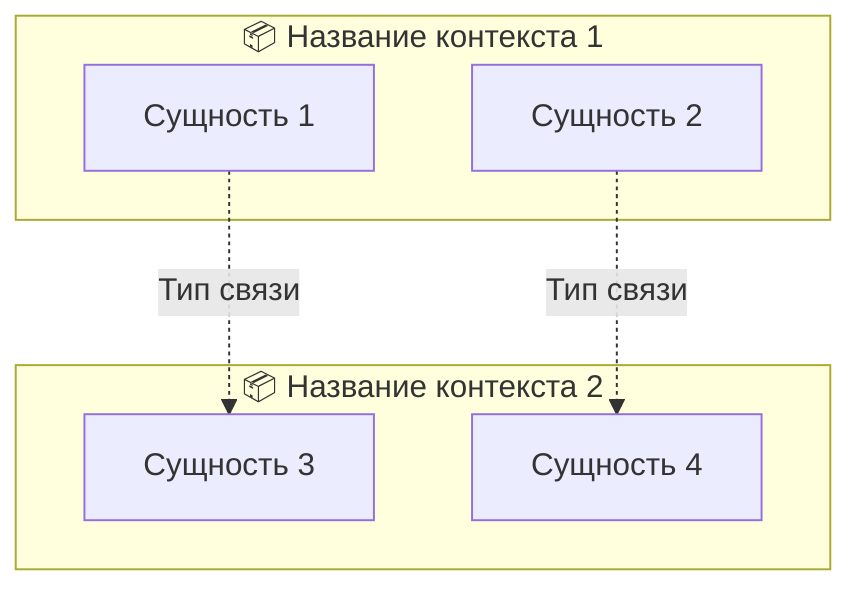

# Практика к лекции 2: DDD, Event Storming, Quality Attribute Scenarios

## Цель практики

Отработать навыки декомпозиции предметной области с помощью Domain-Driven Design (DDD) и Event Storming, научиться формулировать измеримые требования к качеству системы через Quality Attribute Scenarios.

**Отрабатываемый навык:** Перевод бизнес-требований в архитектурные артефакты (контексты, события, NFR).

**Создаваемый артефакт:** Architecture Brief с выделенными ограниченными контекстами, списком доменных событий и Quality Attribute Scenarios.

---

## Кейс

**Сервис каршеринга «DriveShare»**

**Описание компании:** Стартап запускает сервис краткосрочной аренды автомобилей в городе с населением примерно 1 миллион человек. Планируется работа в 3 городах в течение первого года.

**Текущая ситуация:**
- Команда состоит из 8 человек (4 backend, 2 frontend, 1 DevOps, 1 QA)
- Бюджет на запуск: примерно 5 млн руб.
- Срок до запуска: 3 месяца
- Парк автомобилей: примерно 200 машин в каждом городе

**Проблема:**
При первоначальном обсуждении требований выяснилось, что участники проекта по-разному понимают ключевые сущности:
- **Продуктовый менеджер** говорит о «Тарифах» как о маркетинговом инструменте со скидками и акциями
- **Разработчик** понимает «Тариф» как формулу расчёта стоимости в базе данных
- **Бухгалтер** видит «Тариф» как статью дохода с налоговыми категориями
- **Оператор** считает «Тариф» инструментом управления спросом (повышение цен в часы пик)

Кроме того, есть неясности с процессами:
- Кто отвечает за возврат залога при отмене бронирования?
- Как обрабатываются штрафы от ГИБДД — автоматически или вручную?
- Должна ли поддержка видеть полную историю платежей клиента?

**Задача:** Провести мини-сессию Event Storming для выявления доменных событий, выделения ограниченных контекстов и формулировки Quality Attribute Scenarios.

---

## Входные данные

1. **Бизнес-цель:** Запустить сервис за 3 месяца с парком примерно 200 автомобилей, достичь 1000 активных пользователей к концу первого года, увеличить повторные покупки на 20%.

2. **Ключевые стейкхолдеры:**
   - Клиенты (арендаторы автомобилей)
   - Операторы парка (техническое обслуживание, мойка, заправка)
   - Бухгалтеры (учёт доходов/расходов, налоги)
   - Служба поддержки (обращения клиентов, инциденты)
   - Менеджеры парка (управление доступностью, тарифами)
   - Партнёры (платёжные системы, страховые компании, ГИБДД)

3. **Ограничения:**
   - Бюджет на запуск: примерно 5 млн руб.
   - Срок: 3 месяца до MVP
   - Команда: 8 человек
   - Интеграции: платёжные системы (Stripe/CloudPayments), страховые компании, ГИБДД (проверка штрафов), навигационные сервисы (Яндекс.Карты, Google Maps)

4. **Функциональные возможности MVP:**
   - Регистрация и верификация пользователей
   - Поиск и бронирование автомобилей
   - Аренда по минутам/часам/дням
   - Оплата банковской картой
   - Возврат автомобиля
   - Обработка штрафов
   - Служба поддержки

---

## Задание

### Шаг 1: Анализ текущего состояния (10 мин)

**Действия:**
1. Опишите бизнес-цель проекта своими словами
2. Перечислите ключевых стейкхолдеров (минимум 5) и их интересы
3. Выявите потенциальные противоречия в понимании сущностей (как в примере с «Тарифом»)

**Ожидаемый результат:** Список стейкхолдеров с описанием их интересов и выявленные противоречия в терминологии.

---

### Шаг 2: Выявление доменных событий (15 мин)

**Действия:**
1. Проведите мини-сессию Event Storming (можно на бумаге или в Miro/Mural)
2. Выпишите минимум 10 доменных событий
3. Сформулируйте события в прошедшем времени (глагол в прошедшем времени)

**Примеры событий для ориентира:**
- «Пользователь зарегистрировался»
- «Автомобиль забронирован»
- «Поездка началась»
- «Оплата прошла»

**Ожидаемый результат:** Список из 10+ доменных событий с указанием предполагаемого контекста.

---

### Шаг 3: Определение ограниченных контекстов (10 мин)

**Действия:**
1. Сгруппируйте события по контекстам
2. Выделите 4–6 ограниченных контекстов
3. Дайте каждому контексту название и опишите ответственность
4. Для каждого контекста укажите ключевые сущности

**Ожидаемый результат:** Таблица с описанием контекстов.

---

### Шаг 4: Построение Context Map (10 мин)

**Действия:**
1. Нарисуйте схему связей между контекстами (от руки или в Mermaid)
2. Укажите тип связи для каждой пары контекстов (Partnership, Customer-Supplier, Conformist, ACL и т.д.)
3. Отметьте внешние системы (платёжные шлюзы, ГИБДД, страховые)

**Ожидаемый результат:** Diagram Context Map со связями и типами интеграций.

---

### Шаг 5: Формулировка Quality Attribute Scenarios (15 мин)

**Действия:**
1. Выберите 3 ключевых требования к качеству (например: производительность, доступность, консистентность)
2. Сформулируйте каждый по шаблону Quality Attribute Scenario:
   - Stimulus (воздействие)
   - Environment (окружение)
   - Response (реакция)
   - Response Measure (мера реакции)
3. Убедитесь, что меры измеримы (числа, проценты, время)

**Ожидаемый результат:** 3 Quality Attribute Scenarios в табличной форме.

---

### Шаг 6: Заполнение Architecture Brief (10 мин)

**Действия:**
Заполните шаблон Architecture Brief:

```markdown
# Architecture Brief: DriveShare Carsharing

## Бизнес-цель
[Описание]

## Ключевые стейкхолдеры
1. [Стейкхолдер] — [Интерес]
2. ...

## Ограниченные контексты
| Контекст | Ответственность | Ключевые сущности | Требования к данным |
|----------|-----------------|-------------------|---------------------|
| [...] | [...] | [...] | [...] |

## Доменные события (выборка)
1. [...]
2. [...]
3. [...]

## Quality Attribute Scenarios
### Scenario 1: [Название]
| Элемент | Значение |
|---------|----------|
| Stimulus | [...] |
| Environment | [...] |
| Response | [...] |
| Response Measure | [...] |

### Scenario 2: [Название]
[...]

### Scenario 3: [Название]
[...]

## Ключевые решения и обоснования
1. [Решение] — [Обоснование]
2. ...
```

**Ожидаемый результат:** Заполненный Architecture Brief.

---

## Шаблоны результата

### Шаблон 1: Список доменных событий

```markdown
## Доменные события

| № | Событие | Контекст | Описание |
|---|---------|----------|----------|
| 1 | Пользователь зарегистрировался | Пользователи | Новый пользователь создал аккаунт |
| 2 | Автомобиль добавлен в парк | Телематика | Оператор добавил новый автомобиль в систему |
| 3 | ... | ... | ... |
```

---

### Шаблон 2: Описание контекста

```markdown
## Контекст: [Название]

**Ответственность:** [Что делает контекст, какую бизнес-функцию выполняет]

**Ключевые сущности:**
- [Сущность 1]: [Описание, ключевые атрибуты]
- [Сущность 2]: [Описание, ключевые атрибуты]
- [Сущность 3]: [Описание, ключевые атрибуты]

**Доменные события:**
- [Событие 1]
- [Событие 2]
- [Событие 3]

**Требования к данным:**
- Консистентность: [strong / eventual] — [Обоснование]
- Частота записи: [низкая / средняя / высокая] — [Примерное количество операций в час]
- Хранение: [примерно X лет] — [Требование регуляторов или бизнеса]
- Объём данных: [примерно X ГБ в месяц] — [Оценка]
```

---

### Шаблон 3: Quality Attribute Scenario

```markdown
## Scenario: [Название, например "Производительность бронирования"]

| Элемент | Значение |
|---------|----------|
| Source of Stimulus | [Кто инициирует? Например: Пользователь] |
| Stimulus | [Что происходит? Например: Отправляет запрос на бронирование] |
| Environment | [В каких условиях? Например: Часы пик, 500 одновременных пользователей] |
| Artifact | [Какой компонент? Например: Сервис бронирования] |
| Response | [Что система делает? Например: Обрабатывает запрос и подтверждает бронирование] |
| Response Measure | [Как измерить? Например: 95% запросов обрабатываются менее чем за 300 мс] |

**Полная формулировка:**
[Текст scenario в одном предложении, например: "При нагрузке 500 одновременных пользователей в часы пик (18:00–20:00) сервис бронирования должен обрабатывать 95% запросов менее чем за 300 мс."]
```

---

### Шаблон 4: Context Map (Mermaid)



---

## Критерии оценки

| Критерий | Вес | Описание | Макс. баллы |
|----------|-----|----------|-------------|
| **Полнота событий** | 20% | Выявлено минимум 10 событий, покрывающих основные процессы (бронирование, поездка, оплата, штрафы, поддержка) | 20 |
| **Корректность контекстов** | 25% | Контексты выделены по бизнес-границам, а не техническим; названия отражают бизнес-функции | 25 |
| **Качество Context Map** | 20% | Связи между контекстами логичны, типы связей указаны корректно, внешние системы отмечены | 20 |
| **Измеримость NFR** | 20% | Все 3 Quality Attribute Scenarios имеют измеримые меры (числа, проценты, время) | 20 |
| **Связь с бизнес-целями** | 15% | Решения поддерживают бизнес-цель проекта (запуск за 3 месяца, 1000 пользователей) | 15 |
| **Итого** | 100% | | **100** |

**Шкала оценки:**
- 90–100 баллов: Отлично
- 75–89 баллов: Хорошо
- 60–74 баллы: Удовлетворительно
- Менее 60 баллов: Требуется доработка

---

## Подсказки

💡 **Фокус на бизнес-процессах:** Выделяйте контексты на основе бизнес-возможностей (бронирование, оплата, поддержка), а не технических слоёв (Frontend, Backend, Database).

💡 **Единый язык:** Внутри каждого контекста используйте термины последовательно. Если «Бронирование» и «Поездка» — разные понятия, не смешивайте их в одном контексте.

💡 **Измеримость NFR:** Избегайте размытых формулировок. Вместо «быстро» пишите «95% запросов < 300 мс». Вместо «надёжно» — «доступность 99.9%».

💡 **Внешние системы:** Не забудьте про интеграции с платёжными системами, ГИБДД, страховыми компаниями — они часто становятся отдельными контекстами с Anti-Corruption Layer.

💡 **Eventual consistency:** Между контекстами допустима eventual consistency (согласованность в конечном счёте). Строгая консистентность требуется только внутри агрегата.

💡 **Закон Конвея:** Помните, что границы контекстов часто становятся границами команд. Структурируйте контексты так, чтобы команды могли работать независимо.

---

## Типичные ошибки

❌ **Единая модель на всё (Big Ball of Mud):** Попытка создать одну сущность «Автомобиль» или «Пользователь» для всех контекстов.

**Как избежать:** Выделите отдельные модели в каждом контексте. «Автомобиль» в бронировании — это доступность и тариф, в телематике — GPS и состояние.

---

❌ **Технические границы вместо бизнес-логических:** Разделение на контексты по слоям (Frontend, Backend, Database).

**Как избежать:** Задайте вопрос: «Какую бизнес-функцию выполняет этот контекст?» Если ответ технический («хранит данные»), пересмотрите границы.

---

❌ **Размытые NFR:** «Система должна быть быстрой и надёжной» без конкретных метрик.

**Как избежать:** Используйте шаблон Quality Attribute Scenario с обязательным полем Response Measure.

---

❌ **Отсутствие бизнес-экспертов:** Event Storming проведён только разработчиками без участия экспертов предметной области.

**Как избежать:** Пригласите Product Owner, операторов, бухгалтеров на сессию. Их знания критичны для правильного понимания домена.

---

❌ **Прямые зависимости между контекстами:** Контексты напрямую читают таблицы друг друга через SQL JOIN.

**Как избежать:** Интеграция только через API или события. Каждый контекст владеет своими данными.

---

❌ **Игнорирование внешних систем:** Платёжные шлюзы, ГИБДД, страховые не учтены в Context Map.

**Как избежать:** Явно отметьте внешние системы на карте и укажите тип интеграции (ACL, Open Host Service).

---

## Связь с итоговым проектом

Этот артефакт станет частью финальной документации проекта — **Architecture Blueprint**.

### Где будет использован

- **Раздел 2: Предметная область и контексты** — описание выделенных ограниченных контекстов
- **Раздел 3: Интеграции** — Context Map со связями между контекстами
- **Раздел 4: Требования к качеству** — Quality Attribute Scenarios
- **Раздел 8: Архитектурные решения** — обоснование выбора стилей и технологий

### Как повлияет на следующие шаги

1. **Лекция 3 (Архитектурные стили):** Выделенные контексты станут основой для выбора архитектурного стиля (монолит, микросервисы, модульный монолит) для каждого контекста.

2. **Лекция 4 (Архитектура данных):** На основе требований к данным из контекстов будет выбрана матрица соответствия «Домен — Тип СУБД» (реляционные, документные, графовые и т.д.).

3. **Лекция 5 (Интеграции):** Context Map определит типы интеграций между контекстами (синхронные API, асинхронные очереди, события).

4. **Лекция 7 (Trade-offs):** Quality Attribute Scenarios станут входными данными для анализа компромиссов (ATAM) и принятия архитектурных решений (ADR).

### Что потребуется доработать в будущем

1. **Детализация моделей данных:** Внутри каждого контекста потребуется детализировать сущности, атрибуты, связи (ER-диаграммы).

2. **Выбор конкретных технологий:** Для каждого контекста выбрать тип СУБД (PostgreSQL, MongoDB, Redis и т.д.), фреймворки, инструменты интеграции.

3. **Оценка trade-offs:** Проанализировать компромиссы выбранных решений (производительность vs консистентность, стоимость vs надёжность).

4. **Документирование решений:** Оформить ключевые решения в виде Architecture Decision Records (ADR).

5. **План миграции:** Если существует легаси-система, разработать план перехода на новую архитектуру.

---

## Пример выполнения (фрагмент)

### Доменные события (пример)

| № | Событие | Контекст |
|---|---------|----------|
| 1 | Пользователь зарегистрировался | Пользователи |
| 2 | Пользователь верифицирован | Пользователи |
| 3 | Автомобиль добавлен в парк | Телематика |
| 4 | Автомобиль забронирован | Бронирование |
| 5 | Бронирование подтверждено | Бронирование |
| 6 | Поездка началась | Телематика |
| 7 | Поездка завершена | Телематика |
| 8 | Оплата прошла успешно | Оплата |
| 9 | Штраф выставлен | Штрафы |
| 10 | Обращение создано | Поддержка |

### Контекст: Бронирование (пример)

**Ответственность:** Управление доступностью автомобилей, обработка бронирований, расчёт предварительной стоимости.

**Ключевые сущности:**
- **Бронирование:** ID, UserID, CarID, StartTime, EndTime, Status, TotalAmount
- **Автомобиль (доступность):** ID, Class, RateID, AvailableFrom, AvailableTo, Status
- **Тариф:** ID, Name, BaseRate, PerMinuteRate, PerHourRate, DiscountRules

**Доменные события:**
- «Автомобиль забронирован»
- «Бронирование подтверждено»
- «Бронирование отменено»
- «Бронирование истекло»

**Требования к данным:**
- Консистентность: **strong** — нельзя забронировать один автомобиль дважды
- Частота записи: **средняя** — примерно 50–100 бронирований в час в часы пик
- Хранение: **примерно 5 лет** — требование для разрешения споров
- Объём данных: **примерно 1 ГБ в месяц** — оценка

### Quality Attribute Scenario: Производительность бронирования (пример)

| Элемент | Значение |
|---------|----------|
| Source of Stimulus | Пользователь мобильного приложения |
| Stimulus | Отправляет запрос на бронирование автомобиля |
| Environment | Часы пик (18:00–20:00), нагрузка 500 одновременных пользователей |
| Artifact | Сервис бронирования (Booking Service) |
| Response | Система обрабатывает запрос, проверяет доступность, создаёт бронирование и возвращает подтверждение |
| Response Measure | 95% запросов обрабатываются менее чем за 300 мс; 99% — менее чем за 500 мс |

**Полная формулировка:** «При нагрузке 500 одновременных пользователей в часы пик (18:00–20:00) сервис бронирования должен обрабатывать 95% запросов на создание бронирования менее чем за 300 мс и 99% запросов — менее чем за 500 мс.»

---

## Инструкция по сдаче работы

1. **Формат:** Markdown-файл или PDF
2. **Структура:** Используйте шаблоны из раздела «Шаблоны результата»
3. **Объём:** 3–5 страниц (без учёта диаграмм)
4. **Диаграммы:** Context Map в формате Mermaid или изображение (PNG/SVG)
5. **Срок:** [Указывается преподавателем]
6. **Критерии:** См. таблицу «Критерии оценки»

**Что отправить:**
- Architecture Brief (заполненный шаблон)
- Список доменных событий (10+)
- Context Map (диаграмма)
- 3 Quality Attribute Scenarios

**Как отправить:** [Указывается преподавателем: LMS, GitHub, email и т.д.]
